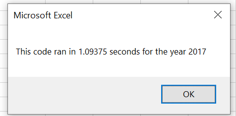
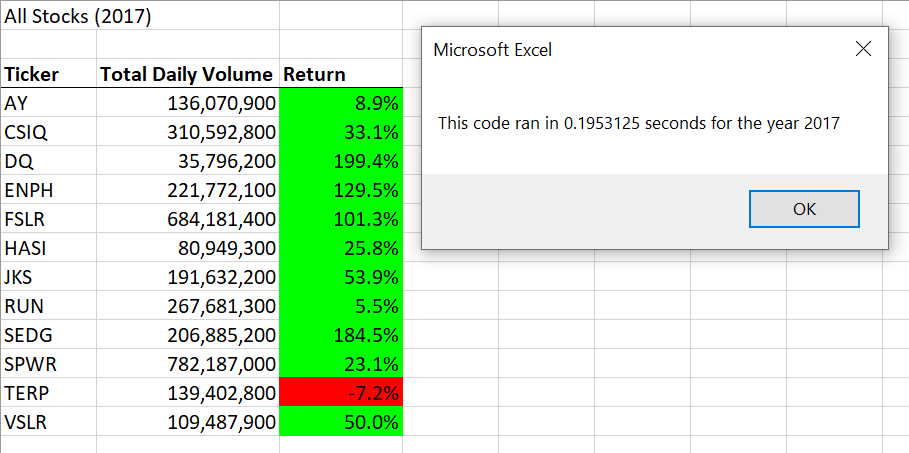
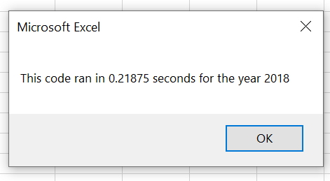

# Stock Analysis (VBA Challenge)

## Overview of Project

### Purpose
Explain Purpose

## Results

### Refactoring the code
Explain difference

### Run-time Comparison
Explain difference

## Summary

### Advantages and disadvantages on Refactoring Code
Explain 

### Impact on VBA Challenge Script from Refactoring
Explain 
