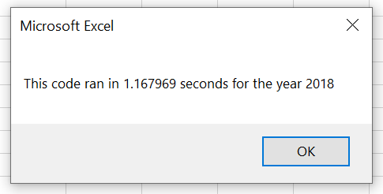
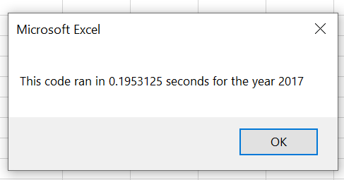

# Stock Analysis (VBA Challenge)

## Overview of Project

### Purpose
Steve asked us to help him analyze a group of green stocks to compare to understand which stocks are worth investing in. To complete this task efficiently, I used VBA Scripting to summarize the Total Daily Volume and Percent Return for all of the green stocks in the data set for a given year value. In this data we’re able to analyze 2017 and 2018. Steve needs to be able to run the analysis quickly in order to spend more time comparing results and making decisions. For this, we’re going to refactor the original code created to help speed up the run-time on this analysis.

## Results

### Stock Performance
After running this code it’s clear the industry at a whole changed quite a bit between these 2 years. Without looking at 2017 or 2019 as a comparison, it’s hard to determine if the green market boomed in 2017 or took a large hit in 2017. The total volume for all green stocks did not change much as it was only a $200 million increase to a $3.1 billion dollar market. There was a more dispersed market in 2018 compared to 2017 where 2 stocks handled most of the volume.

Steve’s parents did a great job investing in DAQO in 2017 with the stock providing the largest return across these green stocks in the analysis with a 199.45% return. This stock was also the least traded in 2017 with the lowest Total Daily Volume. Though in 2018 DAQO lost a lot of its momentum with the lowest return across the green stocks with a -62.60% return. DAQO also remained low traded in 2018 compared across these stocks. Steve’s parents would have benefited in taking the large return in 2017 and diversifying their money in 2018. Though they would have likely still have seen a negative return it would have been a lot smaller.

For further analysis I would start to look at 2019 and possibly look into 2016 to understand some of the volatility of the market and DAQO. I would also suggest looking at other characteristics of ENPH to better understand why their growth didn’t fluctuate almost at all through 2017 and 2018. They were clearly the best stock across the 2 years, providing the second highest return in 2017 and the highest in 2018. The market also followed this stock in 2018 with it being the highest traded stock in 2018.

**2017 Stock Performance**

**2018 Stock Performance**

### Refactoring the code
Explain difference

**Original Code Performance**

    Sub AllStockAnalysis()

      Dim startTime As Single
      Dim endTime As Single

        yearValue = InputBox("What year would you like to run the analysis on?")

        startTime = Timer

    '1) Format the output sheet on All Stocks Analysis worksheet

    Worksheets("All Stocks Analysis").Activate
    
    Range("A1").Value = "All Stocks (" + yearValue + ")"
    
    'Header Row
    Cells(3, 1).Value = "Ticker"
    Cells(3, 2).Value = "Total Daily Volume"
    Cells(3, 3).Value = "Return"
    
    '2) Initialize array of all tickers
    Dim tickers(11) As String
    
        tickers(0) = "AY"
        tickers(1) = "CSIQ"
        tickers(2) = "DQ"
        tickers(3) = "ENPH"
        tickers(4) = "FSLR"
        tickers(5) = "HASI"
        tickers(6) = "JKS"
        tickers(7) = "RUN"
        tickers(8) = "SEDG"
        tickers(9) = "SPWR"
        tickers(10) = "TERP"
        tickers(11) = "VSLR"
        
        
    '3a) Initialize variables for starting price and ending price

    Dim startingPrice As Double
    Dim endingPrice As Double
    
    '3b) Activate data worksheet

    Worksheets(yearValue).Activate
    
    '3c) Get the number of rows to loop over

    RowCount = Cells(Rows.Count, "A").End(xlUp).Row

    '4) Loop through tickers

    For i = 0 To 11
        
        ticker = tickers(i)
        totalVolume = 0

    '5) loop through rows in the data

        Worksheets(yearValue).Activate
        
        For j = 2 To RowCount
    
        '5a) Get total volume for current ticker
        
        If Cells(j, 1).Value = ticker Then

            totalVolume = totalVolume + Cells(j, 8).Value

        End If
        
        
        '5b) get starting price for current ticker
    
        If Cells(j - 1, 1).Value <> ticker And Cells(j, 1).Value = ticker Then

            startingPrice = Cells(j, 6).Value

        End If
        
    
        '5c) get ending price for current ticker
        
        If Cells(j + 1, 1).Value <> ticker And Cells(j, 1).Value = ticker Then
        
            endingPrice = Cells(j, 6).Value
            
        End If
    
    Next j
    
   
    '6) Output data for current ticker
    
        Worksheets("All Stocks Analysis").Activate
        Cells(4 + i, 1).Value = ticker
        Cells(4 + i, 2).Value = totalVolume
        Cells(4 + i, 3).Value = endingPrice / startingPrice - 1

    Next i
    

    'Formatting
    Worksheets("All Stocks Analysis").Activate
    Range("A3:C3").Font.Bold = True
    Range("A3:C3").Borders(xlEdgeBottom).LineStyle = xlContinuous
    Range("B4:B15").NumberFormat = "$#,##0.00"
    Range("C4:C15").NumberFormat = "0.00%"
    Columns("B").AutoFit
    
    
    dataRowStart = 4
    dataRowEnd = 15
    For i = dataRowStart To dataRowEnd

        If Cells(i, 3) > 0 Then

            'Color the cell green
            Cells(i, 3).Interior.Color = vbGreen

        ElseIf Cells(i, 3) < 0 Then

            'Color the cell red
            Cells(i, 3).Interior.Color = vbRed

        Else

            'Clear the cell color
            Cells(i, 3).Interior.Color = xlNone

        End If

    Next i
      
        endTime = Timer
        MsgBox "This code ran in " & (endTime - startTime) & " seconds for the year " & (yearValue)

    End Sub

**Refactored Code Performance**

    Sub AllStocksAnalysisRefactored()
      Dim startTime As Single
      Dim endTime  As Single

      yearValue = InputBox("What year would you like to run the analysis on?")

      startTime = Timer
    
      'Format the output sheet on All Stocks Analysis worksheet
      Worksheets("All Stocks Analysis").Activate
    
      'Title
      Range("A1").Value = "All Stocks (" + yearValue + ")"
    
      'Create a header row
      Cells(3, 1).Value = "Ticker"
      Cells(3, 2).Value = "Total Daily Volume"
      Cells(3, 3).Value = "Return"

      'Initialize array of all tickers
      Dim tickers(12) As String
    
      tickers(0) = "AY"
      tickers(1) = "CSIQ"
      tickers(2) = "DQ"
      tickers(3) = "ENPH"
      tickers(4) = "FSLR"
      tickers(5) = "HASI"
      tickers(6) = "JKS"
      tickers(7) = "RUN"
      tickers(8) = "SEDG"
      tickers(9) = "SPWR"
      tickers(10) = "TERP"
      tickers(11) = "VSLR"
    
      'Activate data worksheet
      Worksheets(yearValue).Activate
    
      'Get the number of rows to loop over
      RowCount = Cells(Rows.Count, "A").End(xlUp).Row
    
      '1a) Create a ticker Index
      Dim tickerIndex As Single
      tickerIndex = 0

      '1b) Create three output arrays
      Dim tickerVolumes(12) As Long
      Dim tickerStartingPrices(12) As Single
      Dim tickerEndingPrices(12) As Single
    
      '2a) Create a for loop to initialize the tickerVolumes to zero.
      For i = 0 To 11
      tickerVolumes(i) = 0
    
      Next i
    
    
      '2b) Loop over all the rows in the spreadsheet.
      For i = 2 To RowCount
    
          '3a) Increase volume for current ticker
          tickerVolumes(tickerIndex) = tickerVolumes(tickerIndex) + Cells(i, 8).Value
        
          '3b) Check if the current row is the first row with the selected tickerIndex. If yes, set tickerStartingPrice.
          'If  Then
          If Cells(i, 1).Value = tickers(tickerIndex) And Cells(i - 1, 1).Value <> tickers(tickerIndex) Then
            tickerStartingPrices(tickerIndex) = Cells(i, 6).Value
            
          End If
          'End If
        
          '3c) Check if the current row is the last row with the selected ticker. If yes, set tickerEndingPrice.
          'If  Then
          If Cells(i, 1).Value = tickers(tickerIndex) And Cells(i + 1, 1).Value <> tickers(tickerIndex) Then
            tickerEndingPrices(tickerIndex) = Cells(i, 6).Value

            '3d If yes, also increase the tickerIndex.
            tickerIndex = tickerIndex + 1
            
          End If
          'End If
    
        Next i
    
      '4) Loop through your arrays to output the Ticker, Total Daily Volume, and Return.
      For i = 0 To 11
        
        Worksheets("All Stocks Analysis").Activate
        Cells(i + 4, 1).Value = tickers(i)
        Cells(i + 4, 2).Value = tickerVolumes(i)
        Cells(i + 4, 3).Value = tickerEndingPrices(i) / tickerStartingPrices(i) - 1
        
      Next i
    
      'Formatting
      Worksheets("All Stocks Analysis").Activate
      Range("A3:C3").Font.FontStyle = "Bold"
      Range("A3:C3").Borders(xlEdgeBottom).LineStyle = xlContinuous
      Range("B4:B15").NumberFormat = "#,##0"
      Range("C4:C15").NumberFormat = "0.0%"
      Columns("B").AutoFit

      dataRowStart = 4
      dataRowEnd = 15

      For i = dataRowStart To dataRowEnd
        
        If Cells(i, 3) > 0 Then
            'Make cell green
            Cells(i, 3).Interior.Color = vbGreen
            
        Else
            'Make cell red
            Cells(i, 3).Interior.Color = vbRed
            
        End If
        
      Next i
 
      endTime = Timer
      MsgBox "This code ran in " & (endTime - startTime) & " seconds for the year " & (yearValue)

    End Sub

### Run-time Comparison
As seen in the pop up message above in the Stock Performance section, refactoring the code was able to generate a quicker return time which helps Steve conduct his analysis faster. The speed of this report increased by over 500% for both years. The original code’s average return time was 1.13 seconds while the refactored code averaged 0.21 seconds. The goal when refactoring the code is to keep the run-time minimized as more values are added to the analysis.

| Year & Code | Run-Time (in seconds) |
| --- | --- |
| 2017 Original | 1.09 |
| 2018 Refactored | 0.20 |
| 2018 Original | 1.17 |
| 2018 Refactored | 0.22 |

**Original Code Performance**

**Refactored Code Performance**

## Summary

### Advantages and disadvantages on Refactoring Code
The main advantages to refactoring code are that the code will operate more efficiently and will be easier to follow in the future. This can save time spent running the code and will make it easier for others to understand and update the code in the future. The main disadvantages of refactoring is it takes time to complete and you’re editing a working script with a chance of error. If you have time to refactor it can be beneficial but if you’re one tight timeline this might not be the best idea especially because rushing through the refactoring increases the chances of an error. If you save out the original code before beginning you can always revert back to that code if any issues arise. 

### Impact on VBA Challenge Script from Refactoring
For the script in this challenge, the code does operate more efficiently and should be easier to follow and add to in the future. The advantage of a quicker run-time is not that significant now, but could be substantial if more information is needed for analysis. This could be if we want to add 2019 data or more if more values are needed to be added for analysis. Not only will adding to this in the future be easier, but as more data and values are analyzed the run-time of the code will stay minimized. For now the code does decrease the run-time by over 500% but in reality that’s only 1 second in time. 

The disadvantage here was also less significant because there was plenty of time to test and complete the refactoring of the code. It was definitely challenging to complete the refactoring of code with plenty of debugging done to ensure the code would run correctly. This would have been very difficult to complete if Steve had a very high turnaround time request on the refactoring.

